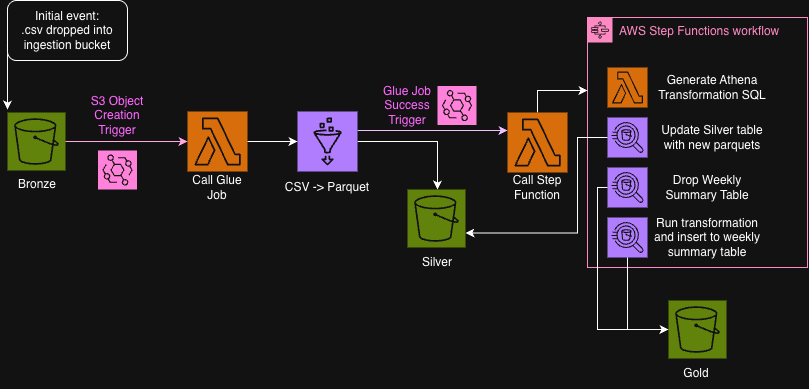
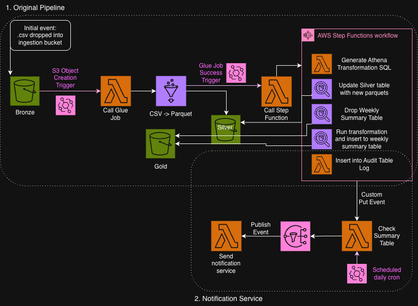

# Agent Activity ETL Pipeline

## TL;DR
If you'd like to skip directly to the sql used to resolve problem #1 you can view the main transformation logic: [`infra/lambda/generate_athena_query/weekly_summary.sql`](infra/lambda/generate_athena_query/weekly_summary.sql)
My description to resolve problem #2 can be found in this README under [`Architecture: Part Two (Proposed)`](#architecture-part-two-proposed).

## Overview
This repository contains an event-driven ETL and analytics pipeline for agent activity data. Raw CSV uploads are transformed to Parquet and aggregated into weekly summaries via SQL, using a serverless AWS stack provisioned with AWS CDK. The implementation emphasizes clear separation of data layers, operational reliability, and easy redeployments.

Part one of the pipeline is fully implemented. Part two documents the design of a proposed notification service and has not been implemented. I will separate the architecture documentation into two parts to keep with the problem prompt.

## Architecture: Part One (Implemented)
The core pipeline ingests CSV files, converts them to Parquet, and produces weekly rollups for analytics.

### Data Flow (Part One)
1. A CSV file is uploaded to the Bronze S3 bucket.
2. An EventBridge rule triggers `s3_to_glue` Lambda.
3. The Lambda starts a Glue job that converts the ingested CSV to Parquet and writes to the Silver bucket, without any other transformations.
4. Step Functions run Athena to repair the Silver table metadata with the newly appended Parquet files. Athena is also used to run the transformation SQL and update the Gold weekly summary table accordingly.

## [Architecture: Part Two (Proposed)](#architecture-part-two-proposed)
This portion is described but not implemented. It adds a notification service for missing data in the summary table over a 24-hour window.

### Proposed Behavior
- A `check-summary` Lambda validates the prior 24 hours of data.
- It counts expected intervals and flags gaps (anything fewer than 48 half-hour intervals triggers a notification).
- The check runs on both a daily schedule to catch failures to run outside of the expected SLA and would be triggered by a custom job after the step function from the transformation load completes (successfully or otherwise). This would cover both gaps within the intervals and gaps in data loads altogether. 
- An SNS topic fans out notifications to downstream handlers (email, Slack, sms, etc.) via a single notifications lambda router.

## Stack
- AWS CDK (Python)
- S3 (Bronze/Silver/Gold storage layers)
- Glue (CSV to Parquet)
- Lambda (ingestion trigger and orchestration helpers)
- Step Functions (workflow orchestration)
- Athena (SQL transforms + aggregations)
- EventBridge (ingestion triggers and schedules)

## Repository Layout
- `infra/` CDK app and infrastructure code
- `infra/glue/` Glue job script(s)
- `infra/lambda/` Lambda function(s)
- `images/` Architecture diagrams
- `problem_requirements/` Original problem statement and inputs

## Configuration
The GitHub Actions workflow uses the following environment variables for deployment:
- `BRONZE_BUCKET`
- `SILVER_BUCKET`
- `GOLD_BUCKET`
- `SCRIPTS_BUCKET`
- `GLUE_ROLE_ARN`
- `LAMBDA_ROLE_ARN`
- `AWS_REGION`
- `CDK_STACK_NAME`

See `.github/workflows/deploy.yml` for the full deployment pipeline and required secrets.

## Deployment
Deployments are handled via GitHub Actions on push to `main` or `dev`, or via manual dispatch. The workflow:
1. Installs CDK + Python dependencies.
2. Uploads the Glue script to S3.
3. Bootstraps CDK (if needed).
4. Deploys the stack.

If you want to deploy locally, follow the same steps in the workflow under `.github/workflows/deploy.yml`.

## Notes
This repository is designed to be redeployable and environment-agnostic. Buckets and IAM roles are injected at deploy time to keep infrastructure flexible across dev and prod environments.
